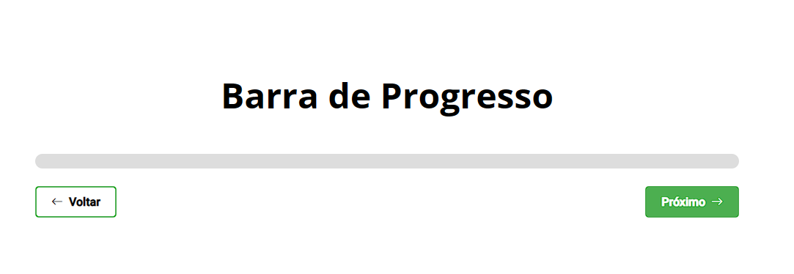

  

## Projeto Barra de Progresso - 💾
Projeto Barra de Progesso realizado em HTML e CSS e JavaScript. Consiste em atualizar a barra de progresso conforme clicamos nos botões para avançar ou voltar.

## Tecnologias - 👨‍💻
- HTML 
- CSS
- JavaScript
- Git e Github
- Boostrap icon
